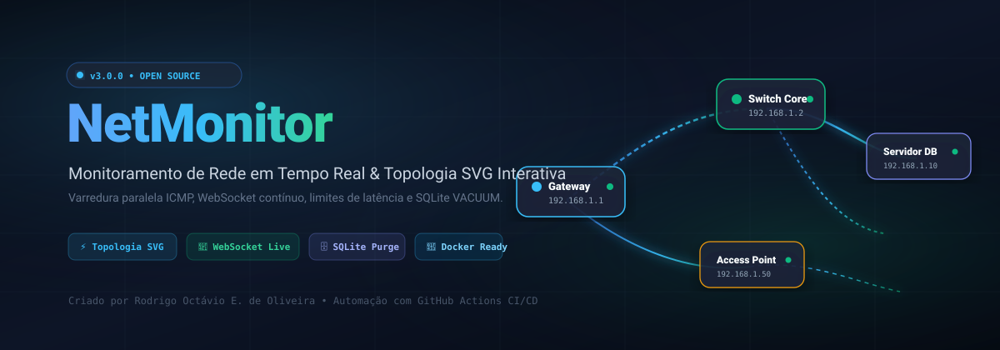
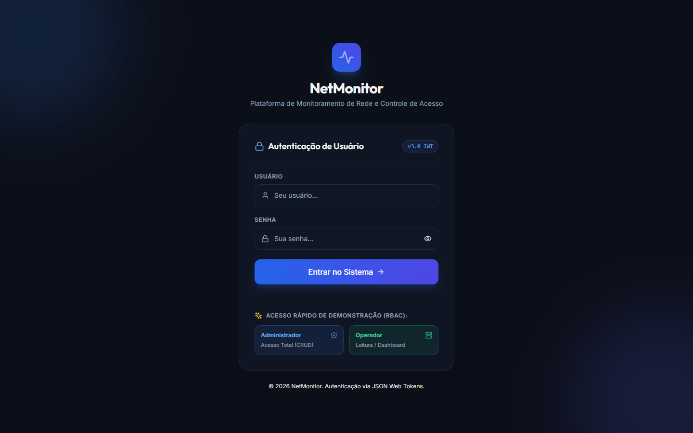
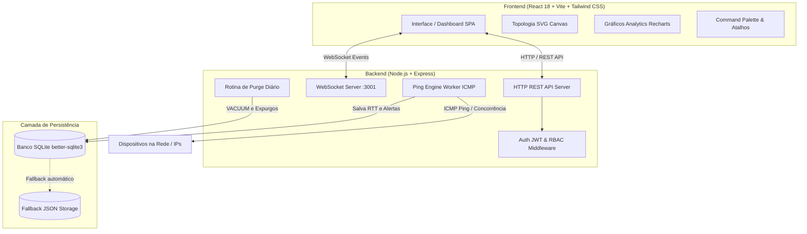
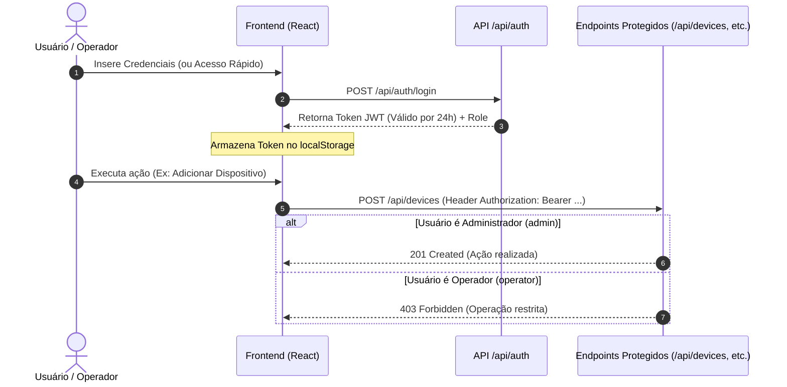

# 🌐 NetMonitor — Sistema Inteligente de Monitoramento e Topologia de Rede

<p align="center">
  
</p>

<p align="center">
  <a href="#-principais-funcionalidades">Funcionalidades</a> •
  <a href="#-demonstração-da-interface">Demonstração</a> •
  <a href="#%EF%B8%8F-arquitetura-do-sistema">Arquitetura</a> •
  <a href="#-instalação-e-execução-rápida">Instalação</a> •
  <a href="#-execução-em-container-docker--docker-compose">Docker</a> •
  <a href="#-apoie-o-projeto-via-pix">Apoiar Projeto</a>
</p>

<p align="center">
  <a href="https://nodejs.org/"></a>
  <a href="https://react.dev/"></a>
  <a href="https://vitejs.dev/"></a>
  <a href="https://sqlite.org/"></a>
  <a href="https://www.docker.com/"></a>
  <a href="https://github.com/RodrigoOctavio1988/netmonitor/actions"></a>
</p>

O **NetMonitor** é uma plataforma completa e moderna para monitoramento contínuo de conectividade e desempenho de infraestruturas de TI e telecomunicações. Desenvolvido com arquitetura cliente-servidor em tempo real, oferece visualização visual e interativa de topologia de rede, detecção proativa de instabilidades, controle de acesso granular e painel analítico avançado.

---

## 🚀 Principais Funcionalidades

- **📡 Monitoramento ICMP em Tempo Real:** Varredura periódica de latência (RTT) e taxa de perda de pacotes transmitidos instantaneamente para a interface via WebSocket bidirecional.
- **🗺️ Topologia de Rede Interativa:**
  - Visualização hierárquica baseada em curvas Bezier SVG e partículas dinâmicas para indicar nós ativos.
  - Conexão e desconexão de nós diretamente na tela com mouse (modo de ligação interativa com guia elástica).
  - Canvas com suporte completo a **Drag-and-Drop** de nós, **Zoom** e **Pan**.
- **⚡ Alertas com Threshold Individual:** Configuração personalizada de limite aceitável de latência (ms) por equipamento (ex: 20ms para backbone de fibra, 150ms para enlaces via rádio), gerando avisos automáticos e sinalizadores visuais caso excedido.
- **📊 Analytics & Gráficos Detalhados:** Métricas de tendência histórica, ranking de piores uptimes e heatmap temporal de disponibilidade de hosts (24h, 7 dias e 30 dias).
- **📋 Modo Lista Densa & Agrupamento:** Alternância flexível entre cards visuais e tabela tabular com ordenação multicamada por colunas e agrupamento por categoria de ativos.
- **🔐 Autenticação JWT e RBAC:**
  - Perfis de acesso distintos: **Administrador** (gestão total de ativos e configurações) e **Operador** (visualização de relatórios, gráficos e status em modo somente leitura).
  - Proteção em todas as rotas da API REST e canais do WebSocket.
- **⌨️ Command Palette (`Ctrl+K`):** Busca global imediata de hosts e atalhos de teclado para navegação de alta produtividade sem uso de mouse.
- **🧹 Otimização de Disco (Purge do SQLite):** Rotina diária automática e sob demanda para expurgo de dados obsoletos e compactação física do arquivo `.db` via `VACUUM`.
- **🐳 Containerização Multi-Stage:** Imagem Docker enxuta e segura executando com usuário não-root e suporte a volumes persistentes.

---

## 📸 Demonstração da Interface

<p align="center">
  
  <br>
  <em>Painel de Controle em Tempo Real com Métricas de Conectividade, Latência e Status dos Hosts</em>
</p>

---

## 🏛️ Arquitetura do Sistema



---

## 🔐 Fluxo de Autenticação e Perfis (RBAC)



---

## ⚡ Instalação e Execução Rápida

### Pré-requisitos
- [Node.js](https://nodejs.org/) versão 18.x ou 20.x instalado.
- [Git](https://git-scm.com/) (opcional).

### 1. Execução no Windows (1 Clique)
Na raiz do projeto, execute o script em lote:
```cmd
start.bat
```
O script instalará dependências ausentes e iniciará simultaneamente o backend (`porta 3001`) e o frontend (`porta 5173`).

### 2. Execução Manual via Terminal
```bash
# 1. Instalar todas as dependências (raiz, backend e frontend)
npm run install-all

# 2. Iniciar o ambiente de desenvolvimento unificado
npm run dev
```

Após iniciar, abra em seu navegador:
👉 **[http://localhost:5173](http://localhost:5173)**

---

## 🐳 Execução em Container (Docker & Docker Compose)

O projeto conta com `Dockerfile` multi-stage otimizado e `docker-compose.yml` para deployment simplificado em ambientes Linux/Windows:

```bash
# Construir e iniciar os containers em segundo plano
docker compose up -d --build

# Acompanhar os logs em tempo real
docker compose logs -f

# Encerrar o container preservando o volume de dados
docker compose down

# Encerrar e remover o volume persistente do SQLite
docker compose down -v
```

Após subir via Docker, a aplicação unificada estará acessível em:
👉 **[http://localhost:3001](http://localhost:3001)**

---

## ⚙️ Variáveis de Ambiente

As configurações do sistema são definidas através de arquivos `.env` ou variáveis do sistema operacional:

### Backend (`backend/.env`)

| Variável | Padrão | Descrição |
|---|---|---|
| `PORT` | `3001` | Porta HTTP da API Express e do WebSocket |
| `DB_PATH` | `./db/netmonitor.db` | Caminho do arquivo de banco de dados SQLite |
| `CORS_ORIGIN` | `http://localhost:5173` | Origens permitidas para requisições CORS |
| `AUTH_ENABLED` | `false` | Se `true`, exige token JWT para chamadas da API |
| `JWT_SECRET` | `netmonitor-super-secret-key-2026` | Chave secreta para assinatura dos tokens JWT |
| `RATE_LIMIT_WINDOW_MS` | `900000` | Janela de tempo do Rate Limiting (15 minutos em ms) |
| `RATE_LIMIT_MAX` | `300` | Limite de requisições por IP na janela de tempo |
| `MAX_DEVICES` | `50` | Limite máximo de dispositivos monitorados no sistema |
| `HISTORY_SIZE` | `100` | Quantidade máxima de registros de latência em memória/cache |

### Frontend (`frontend/.env`)

| Variável | Padrão | Descrição |
|---|---|---|
| `VITE_API_URL` | `http://localhost:3001` | Endereço base da API REST do backend |
| `VITE_WS_URL` | `ws://localhost:3001` | Endereço do servidor WebSocket |

---

## 🔑 Credenciais Pré-configuradas (Demonstração)

Ao ativar a tela de login ou habilitar `AUTH_ENABLED=true`, utilize os usuários pré-cadastrados:

| Perfil | Usuário | Senha | Permissões |
|---|---|---|---|
| **Administrador** | `admin` | `admin123` | Acesso Irrestrito (CRUD de hosts, varredura, otimização de banco) |
| **Operador** | `operador` | `operador123` | Leitura (Visualização de painéis, topologia, relatórios e alertas) |

> 💡 *Dica:* Na tela de login, utilize os botões de **"Acesso Rápido de Teste"** para autenticar com 1 clique.

---

## ⌨️ Atalhos de Teclado (Produtividade)

| Atalho | Ação |
|---|---|
| <kbd>Ctrl</kbd> + <kbd>K</kbd> / <kbd>Cmd</kbd> + <kbd>K</kbd> | Abrir **Command Palette** (busca global e comandos rápidos) |
| <kbd>?</kbd> | Abrir modal de ajuda com todos os atalhos disponíveis |
| <kbd>1</kbd> | Alternar para a aba **Dashboard Geral** |
| <kbd>2</kbd> | Alternar para a aba **Topologia de Rede** |
| <kbd>3</kbd> | Alternar para a aba **Métricas & Analytics** |
| <kbd>4</kbd> | Alternar para a aba **Histórico de Alertas** |
| <kbd>Ctrl</kbd> + <kbd>N</kbd> | Abrir formulário para adicionar novo dispositivo |
| <kbd>Ctrl</kbd> + <kbd>S</kbd> | Iniciar varredura automática de rede |
| <kbd>Esc</kbd> | Fechar qualquer modal ativo ou cancelar ligação de nós |

---

## 🧪 Testes e Validação de Qualidade

Execute a suíte de testes automatizados e compilação de produção:

```bash
# Executar suíte completa de testes Jest no backend
npm test

# Executar compilação de produção do frontend Vite
npm run build
```

---

## 🔄 Pipeline de Integração Contínua (CI/CD)

O projeto possui automação completa configurada com **GitHub Actions** em [`.github/workflows/ci.yml`](.github/workflows/ci.yml). 

A cada `push` ou `pull request` para as branches `main`, `master` ou `develop`, são executados:
1. **Backend Tests:** Execução de testes em matriz com Node.js 18.x e 20.x, instalando utilitários nativos de rede (`iputils-ping`).
2. **Frontend Build:** Instalação e validação do build de produção do Vite e Tailwind CSS.
3. **Docker Multi-Stage Build Check:** Validação sintática e de compilação da imagem Docker final.

---

## 📁 Estrutura do Monorepo

```
PROJETO 1/
├── .github/
│   └── workflows/
│       └── ci.yml               # Pipeline de CI/CD do GitHub Actions
├── backend/
│   ├── db/
│   │   ├── database.js          # Driver SQLite (better-sqlite3) e rotinas de Purge
│   │   └── netmonitor.db        # Banco de dados local relacional
│   ├── middleware/
│   │   └── auth.js              # Middleware JWT e verificação RBAC
│   ├── routes/
│   │   ├── alerts.js            # Endpoints de histórico e limpeza de alertas
│   │   ├── auth.js              # Autenticação e sessão (/login, /me)
│   │   ├── devices.js           # CRUD de hosts e thresholds de latência
│   │   └── settings.js          # Ajustes gerais, estatísticas e purge do SQLite
│   ├── services/
│   │   └── pingService.js       # Agendador e avaliador de pings ICMP
│   ├── server.js                # Servidor Express, WebSocket e rota SPA estática
│   └── package.json
├── frontend/
│   ├── src/
│   │   ├── components/
│   │   │   ├── Dashboard.jsx        # Painel principal com visão Cards/Tabela
│   │   │   ├── NetworkTopology.jsx  # Mapa topológico interativo com drag & SVG
│   │   │   ├── AnalyticsView.jsx    # Gráficos Recharts e heatmap temporal
│   │   │   ├── AlertsHistory.jsx    # Tabela paginada e filtros de alertas
│   │   │   ├── CommandPaletteModal.jsx # Busca rápida global (Ctrl+K)
│   │   │   └── LoginView.jsx        # Tela de login com suporte a RBAC
│   │   ├── hooks/
│   │   │   └── useKeyboardShortcuts.js # Gestor global de atalhos
│   │   ├── App.jsx                  # Estado mestre e integração WebSocket
│   │   └── index.css                # Estilização Tailwind e keyframe animations
│   ├── vite.config.js
│   └── package.json
├── docs/                        # Documentação e ativos visuais
│   └── images/
│       ├── banner.svg           # Banner visual oficial do projeto
│       ├── dashboard-preview.png# Pré-visualização do painel principal
│       └── pix-qrcode.svg       # QR Code PIX para apoio ao desenvolvedor
├── Dockerfile                   # Build multi-stage para ambiente de produção
├── docker-compose.yml           # Orquestração do container com volume persistente
├── package.json                 # Scripts raiz do monorepo (test, build, dev)
├── start.bat                    # Script executável de inicialização no Windows
└── README.md                    # Documentação técnica oficial do sistema
```

---

## ☕ Apoie o Projeto via PIX

Se este projeto foi útil para você, sua equipe ou sua infraestrutura e você deseja incentivar a continuidade do desenvolvimento com novas melhorias (como suporte a IPv6, checagem SSL e Webhooks para Telegram/Discord), considere apoiar com qualquer contribuição:

<p align="center">
  <br><br>
  <strong>Chave PIX (E-mail):</strong> <code>rodrigo.octavio88@gmail.com</code><br>
  <strong>Criador &amp; Desenvolvedor:</strong> <strong>RODRIGO OCTÁVIO EUSTÁQUIO DE OLIVEIRA</strong>
</p>

---

## 📄 Licença

Este projeto é disponibilizado para fins de monitoramento e gestão operacional de redes e infraestrutura. Desenvolvido com foco em alto desempenho, confiabilidade e excelência visual.
